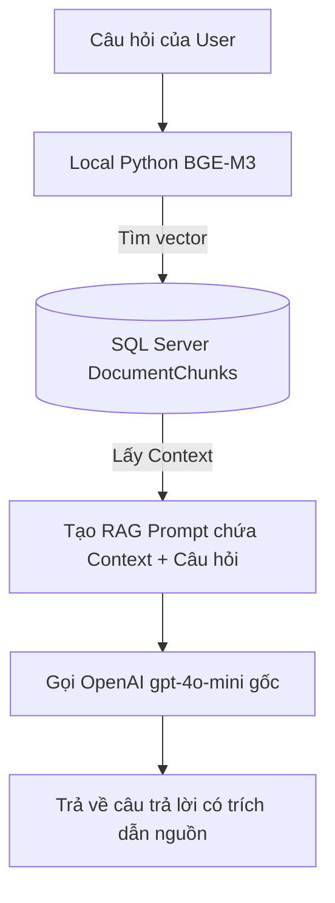
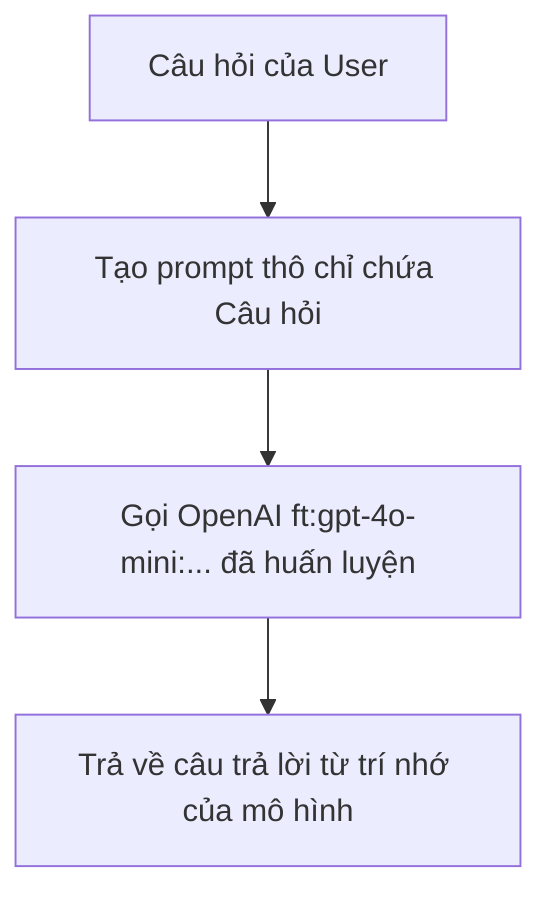

# 📘 Hướng Dẫn Kỹ Thuật: Tích Hợp OpenAI API & Thực Nghiệm So Sánh RAG vs. Fine-Tuning

Tài liệu này hướng dẫn chi tiết cách cấu hình OpenAI API cho mô hình **GPT-4o-Mini**, quy trình chuẩn bị dữ liệu & huấn luyện **Fine-Tuning**, và phương pháp thiết lập hệ thống benchmark thực nghiệm để so sánh trực quan hiệu quả giữa hai kỹ thuật phổ biến nhất hiện nay: **RAG (Retrieval-Augmented Generation)** và **Fine-Tuning**.

---

## 🗺️ Tóm Tắt Kiến Trúc: RAG vs. Fine-Tuning

| Tiêu chí | RAG (Retrieval-Augmented Generation) | Fine-Tuning (Sử dụng Model Tinh Chỉnh) |
| :--- | :--- | :--- |
| **Bản chất** | **Truy xuất & Cung cấp ngữ cảnh**: AI đọc tài liệu ngoài rồi trả lời trực tiếp. | **Thay đổi trọng số mô hình**: Tri thức được học sâu và ghi nhớ trực tiếp vào "não" của AI. |
| **API Key** | Cần cho bước LLM sinh câu trả lời. | Cần cho cả bước huấn luyện lẫn khi gọi chat. |
| **Độ chính xác** | Rất cao, có kèm nguồn đối chiếu, ít bị ảo tưởng. | Phụ thuộc vào tập dữ liệu học, dễ bị "ảo tưởng" (hallucination) nếu câu hỏi lạ. |
| **Tốc độ (Latency)** | Chậm hơn (do prompt chứa tài liệu dài). | Nhanh hơn vượt trội (prompt siêu ngắn). |
| **Khả năng cập nhật** | Tức thời (chỉ cần upload file mới lên DB). | Tốn kém (phải chuẩn bị dữ liệu và huấn luyện lại). |

---

## 🔌 Bước 1: Cấu Hình OpenAI API Key & Kích Hoạt GPT-4o-Mini

Để hệ thống C# có thể gửi dữ liệu trò chuyện lên OpenAI GPT-4o-Mini, bạn cần có API Key hợp lệ và điền vào file cấu hình dự án.

### 1. Cách lấy API Key từ OpenAI
1. Truy cập vào trang quản lý: [OpenAI API Keys](https://platform.openai.com/account/api-keys).
2. Đăng nhập và nhấn **Create new secret key**.
3. Đặt tên gợi nhớ (ví dụ: `PRN222_RBL_Key`) và nhấn **Create secret key**.
4. **Copy mã key ngay lập tức** (mã có dạng `sk-proj-...`). *Lưu ý: Bạn sẽ không thể xem lại mã này sau khi đóng bảng.*

### 2. Điền Key vào Web Application C#
Mở file [appsettings.json](file:///d:/ASM_PRN222/PRN222_Project/PRN222.WebApp/appsettings.json) và tiến hành thay thế giá trị mặc định bằng API Key của bạn:

```json
{
  "AIProviders": {
    "OpenAI": {
      "ApiKey": "sk-proj-ĐIỀN_MÃ_API_KEY_CỦA_BẠN_VÀO_ĐÂY",
      "EmbeddingModel": "text-embedding-3-small",
      "ChatModel": "gpt-4o-mini",
      "FineTunedModel": "" 
    },
    "PythonMicroservice": {
      "BaseUrl": "http://localhost:8000/"
    }
  }
}
```

> [!WARNING]
> Tuyệt đối không đẩy tệp chứa API Key thật của bạn lên các kho mã nguồn công khai (như GitHub Public Repository) để tránh bị lộ khóa và phát sinh chi phí ngoài ý muốn.

---

## 🎯 Bước 2: Kỹ Thuật Huấn Luyện Fine-Tuning mô hình GPT-4o-Mini

Fine-tuning giúp huấn luyện mô hình học sâu cấu trúc, văn phong, và tri thức cốt lõi của tài liệu học tập mà không cần RAG.

### 1. Chuẩn bị tập dữ liệu huấn luyện (Dataset Preparation)
Dữ liệu huấn luyện phải được tổ chức dưới định dạng **JSON Lines (.jsonl)**. Mỗi dòng là một cuộc hội thoại hoàn chỉnh gồm 3 vai trò: `system`, `user`, và `assistant`.

Tạo một tệp tin tên là `dang_learning_data.jsonl` với cấu trúc mẫu như sau:

```json
{"messages": [{"role": "system", "content": "Bạn là Trợ lý AI Học thuật của môn Lịch sử Đảng."}, {"role": "user", "content": "Ban Nghiên cứu Lịch sử Đảng Trung ương được thành lập vào năm nào?"}, {"role": "assistant", "content": "Ban Nghiên cứu Lịch sử Đảng Trung ương (nay là Viện Lịch sử Đảng) được thành lập vào năm 1959."}]}
{"messages": [{"role": "system", "content": "Bạn là Trợ lý AI Học thuật của môn Lịch sử Đảng."}, {"role": "user", "content": "Hội đồng chỉ đạo biên soạn giáo trình quốc gia được ban hành theo quyết định số bao nhiêu?"}, {"role": "assistant", "content": "Hội đồng chỉ đạo biên soạn giáo trình quốc gia các bộ môn khoa học mác - lênin, tư tưởng hồ chí minh được ban hành theo Quyết định số 315/QĐ-TTg."}]}
```

> [!TIP]
> **Khuyến nghị kích thước:**
> * Cần ít nhất **50 - 100 cặp ví dụ chất lượng cao** để mô hình bắt đầu học được cấu trúc.
> * Đối với các tài liệu học tập phức tạp (Triết học, Lịch sử), tập dữ liệu tối ưu nên có từ **500 - 1000 câu hỏi/trả lời** bao quát hết toàn bộ nội dung giáo trình.

### 2. Thực hiện khởi chạy Job Fine-Tuning (Không cần viết code)
OpenAI cung cấp giao diện bảng điều khiển trực quan để huấn luyện mô hình rất tiện lợi:

1. Truy cập vào trang quản lý: [OpenAI Fine-tuning Dashboard](https://platform.openai.com/finetuning).
2. Nhấn nút **Create** ở góc phải màn hình để tạo phiên huấn luyện mới.
3. Chọn cấu hình:
   * **Base model:** Chọn `gpt-4o-mini` (hoặc `gpt-4o-mini-2024-07-18`).
   * **Training data:** Nhấn upload tệp `dang_learning_data.jsonl` bạn đã chuẩn bị.
4. Giữ nguyên các thông số nâng cao (Hyperparameters) mặc định.
5. Nhấn **Start Training**.
6. **Theo dõi tiến trình:** Trạng thái huấn luyện từ `Validating` sẽ chuyển sang `Queued` và `Training`. Thời gian chạy thường mất từ 15 - 45 phút tùy độ lớn tập dữ liệu. Khi hoàn tất, bạn sẽ nhận được thông báo trạng thái `Succeeded`.

### 3. Kích hoạt mô hình đã Fine-tuned vào C# Web App
Khi tiến trình báo hoàn tất, bạn sẽ có một mã nhận diện mô hình đặc thù (Model ID). Ví dụ: `ft:gpt-4o-mini:your-organization:history-party-model:ab12cd34`.

Hãy copy ID này và điền vào trường `FineTunedModel` trong file `appsettings.json`:
```json
"FineTunedModel": "ft:gpt-4o-mini:your-organization:history-party-model:ab12cd34"
```

---

## 📊 Bước 3: Thiết Lập Thực Nghiệm So Sánh RAG vs. Fine-Tuning trong Dự Án

Để chứng minh luận điểm nghiên cứu khoa học (RBL), hệ thống cung cấp luồng chạy đo lường trực quan thông qua bộ mã nguồn C# có sẵn.

### 1. Luồng hoạt động của RAG (Truy xuất + Nhập cảnh)
Trong lớp [ChatService.cs](file:///d:/ASM_PRN222/PRN222_Project/PRN222.Services/ChatService.cs), luồng RAG được thực hiện bằng cách ghép nối thông tin động:


### 2. Luồng hoạt động của Fine-Tuning (Không qua RAG)
Nếu so sánh độc lập với Fine-Tuning không có RAG trợ giúp, luồng xử lý sẽ bỏ qua hoàn toàn bước tìm kiếm:


Trong lớp [OpenAiService.cs](file:///d:/ASM_PRN222/PRN222_Project/PRN222.Services/OpenAiService.cs#L38-L43), luồng chuyển đổi diễn ra tự động nhờ tham số `isFineTuned`:
```csharp
public async Task<string> GenerateChatResponseAsync(string prompt, bool isFineTuned = false)
{
    // Tự động chuyển hướng từ model gốc sang model Fine-Tuned nếu được kích hoạt
    var client = (isFineTuned && _fineTunedChatClient != null) ? _fineTunedChatClient : _chatClient;
    var response = await client.CompleteChatAsync(prompt);
    return response.Value.Content[0].Text;
}
```

---

## 📈 Bước 4: Chạy Đánh Giá (Benchmark) & Thu Thập Số Liệu

Trang **RBL Benchmark Dashboard** trong ứng dụng được thiết kế riêng để chạy kiểm thử hàng loạt câu hỏi và thu về số liệu đánh giá khoa học dựa trên phương pháp **LLM-as-a-Judge**:

### 1. Các tiêu chí đánh giá khoa học (Chấm điểm từ 0.0 đến 1.0)
* **Faithfulness (Độ trung thực):** Đánh giá xem câu trả lời của AI có hoàn toàn trung thực dựa trên tài liệu gốc hay không (chống nói dối/ảo tưởng).
* **Relevance (Độ liên quan):** Đánh giá xem câu trả lời của AI có trả lời trực diện và đầy đủ ý của câu hỏi người dùng hay không.
* **Latency (Thời gian đáp ứng):** Đo bằng mili-giây từ lúc gửi câu hỏi đến lúc nhận kết quả.

### 2. Tiến hành chạy thực nghiệm trên Web UI
1. Đăng nhập tài khoản Admin, điều hướng tới mục **RBL Benchmark Dashboard**.
2. Chọn cấu hình thử nghiệm:
   * **Embedding Model:** `bge-m3` (Local).
   * **Chunking Strategy:** `markdown_header`.
3. Nhấn **Khởi chạy thực nghiệm Benchmark**.
4. **Quan sát thời gian thực:** Nhờ công nghệ `SignalR`, bạn sẽ thấy thanh tiến trình (progress bar) chạy và bảng hiển thị chi tiết điểm chấm Faithfulness, Relevance, Latency của từng câu hỏi tự động nhảy dòng liên tục trên giao diện.

### 3. Đọc hiểu kết quả so sánh khoa học
Sau khi chạy xong, Dashboard sẽ hiển thị đồ thị so sánh. Thông thường kết quả thực tế sẽ phản ánh quy luật sau:

* **Về Độ chính xác (Faithfulness):** **RAG thắng tuyệt đối** (thường đạt ~0.9 - 0.98), vì có sẵn tài liệu kế bên làm bằng chứng. Mô hình **Fine-Tuning đơn thuần** dễ bị giảm điểm (chỉ đạt ~0.7 - 0.8) do bị ảo tưởng thông tin khi gặp câu hỏi lắc léo.
* **Về Tốc độ (Latency):** **Fine-Tuning thắng tuyệt đối** (nhanh hơn RAG từ 2 đến 3 lần) vì kích thước prompt đầu vào cực kỳ nhỏ, mô hình xử lý rất nhanh.
* **Mô hình tối ưu nhất:** Kết hợp **RAG + Fine-Tuning** (sử dụng mô hình Fine-tuned để trả lời trên dữ liệu được RAG tìm kiếm). Đây là kiến trúc cao cấp nhất giúp AI vừa trả lời siêu chuẩn xác theo đúng cấu trúc nghiệp vụ mong muốn, vừa tuyệt đối trung thực với tài liệu.
