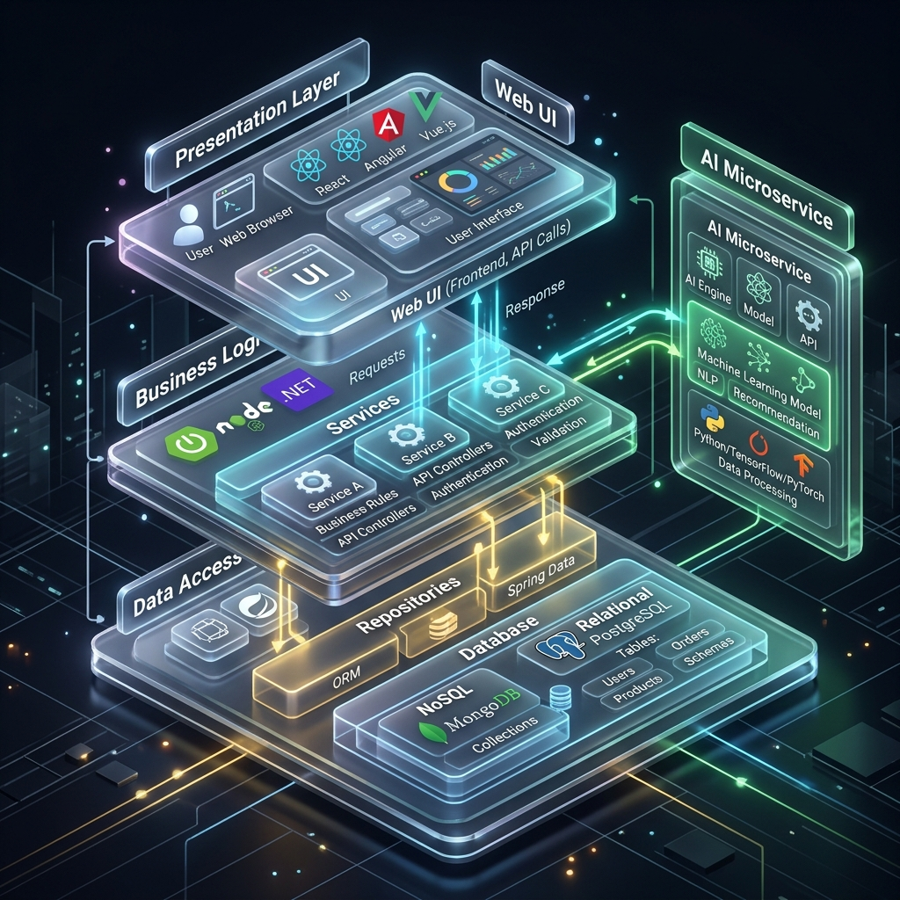

# Cấu trúc dự án 3-Layers (PRN222 Chatbot)

Dưới đây là hình ảnh minh họa cho kiến trúc 3-Layers của hệ thống, bao gồm cả AI Microservice độc lập.

## 1. Sơ đồ cấu trúc chi tiết (Mermaid)
Sơ đồ dưới đây thể hiện luồng phụ thuộc (Dependency flow) một chiều được định nghĩa trong project:

```mermaid
flowchart TD
    %% Define Styles
    classDef presentation fill:#3498db,stroke:#2980b9,stroke-width:2px,color:#fff
    classDef business fill:#2ecc71,stroke:#27ae60,stroke-width:2px,color:#fff
    classDef data fill:#e67e22,stroke:#d35400,stroke-width:2px,color:#fff
    classDef shared fill:#9b59b6,stroke:#8e44ad,stroke-width:2px,color:#fff
    classDef external fill:#e74c3c,stroke:#c0392b,stroke-width:2px,color:#fff
    classDef db fill:#f1c40f,stroke:#f39c12,stroke-width:2px,color:#333

    %% Core Layers
    subgraph Core[Kiến trúc 3-Layer .NET Core]
        UI("🖥️ Presentation Layer<br/><br/><b>PRN222.RazorWebApp</b><br/><i>(Razor Pages, ViewModels, SignalR Clients)</i>"):::presentation
        BLL("⚙️ Business Logic Layer<br/><br/><b>PRN222.Services</b><br/><i>(Interfaces, DTOs, SignalR Hubs)</i>"):::business
        DAL("💾 Data Access Layer<br/><br/><b>PRN222.Repositories</b><br/><i>(EF Core DbContext, Migrations)</i>"):::data
    end

    %% Shared/Cross-cutting
    MODELS("📦 Shared Layer<br/><br/><b>PRN222.Models</b><br/><i>(Entity Classes)</i>"):::shared
    
    %% External
    AI("🧠 External AI Microservice<br/><br/><b>Python_RAG_Server</b><br/><i>(FastAPI, Embeddings, Document Parsing)</i>"):::external
    DB[("🗄️ SQL Server Database<br/><br/><i>PRN222_ChatbotDB</i>")]:::db

    %% Dependencies
    UI -->|Gọi qua Dependency Injection| BLL
    BLL -->|Thao tác qua Repository/DbContext| DAL
    DAL -->|Đọc/Ghi dữ liệu| DB
    
    %% Cross-cutting deps
    UI -.->|View Models & Reference| MODELS
    BLL -.->|Business Models| MODELS
    DAL -.->|EF Entities mapping| MODELS

    %% External deps
    BLL <-->|HTTP API (port 8000)| AI
```

## 2. Hình ảnh minh họa 3D Concept

Tôi cũng đã tạo ra một bản vẽ minh họa không gian 3 chiều hiện đại để thể hiện kiến trúc này:



> [!NOTE]
> **Quy tắc phụ thuộc luồng (Dependency flow) của Project:**
> - `RazorWebApp` (Presentation) **chỉ** được gọi `Services` (BLL). Không được phép gọi thẳng `Repositories`.
> - `Services` **chỉ** gọi `Repositories` và `Models`.
> - Tầng `Models` nằm độc lập, chỉ chứa định nghĩa Data (Entity) - không chứa Business Logic và không phụ thuộc vào bất kỳ layer nào khác.
> - `Python RAG Server` là một Microservice độc lập, chạy trên port `8000`, cung cấp endpoint cho tầng `Services` gọi qua.
