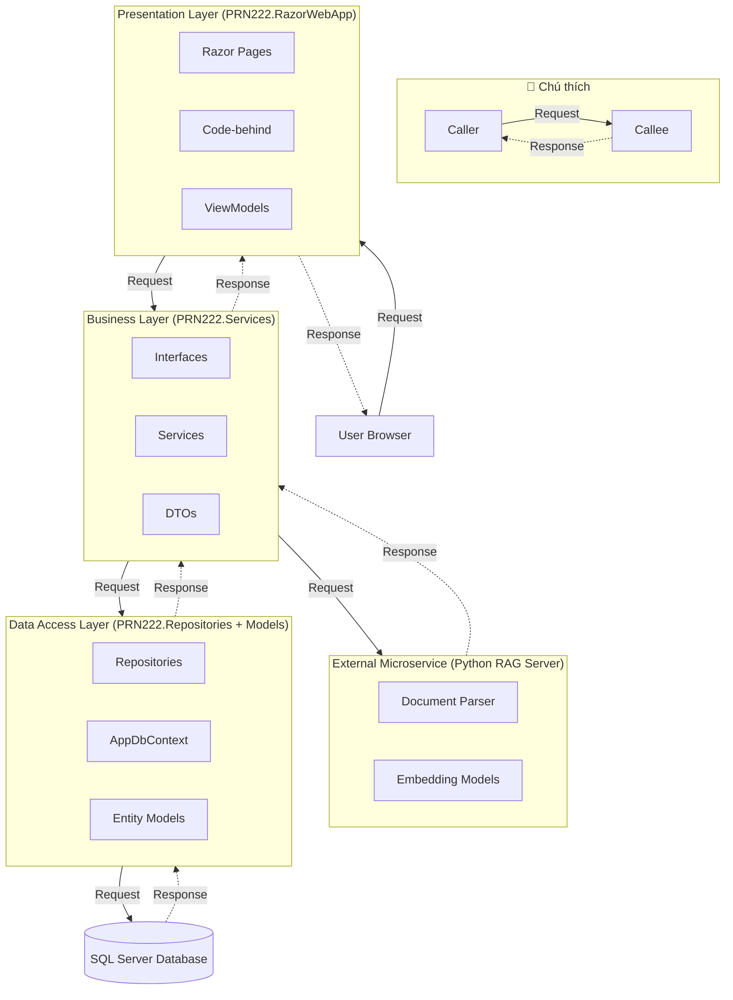

# Kiến trúc hệ thống — PRN222 Project

## Quy ước mũi tên (Sequence / Architecture diagram)

- **Request** = nét **liền** `-->` — đi từ bên gọi → bên được gọi.
- **Response** = nét **đứt** `-.->` — đi ngược lại, đúng cặp với request.

> Mỗi cặp gọi luôn gồm 1 liền + 1 đứt **giữa đúng 2 khối đó**, ngược chiều nhau.
> Không để mũi tên đứt (response) nhảy sang một cặp đối tượng khác.

## Sơ đồ kiến trúc

